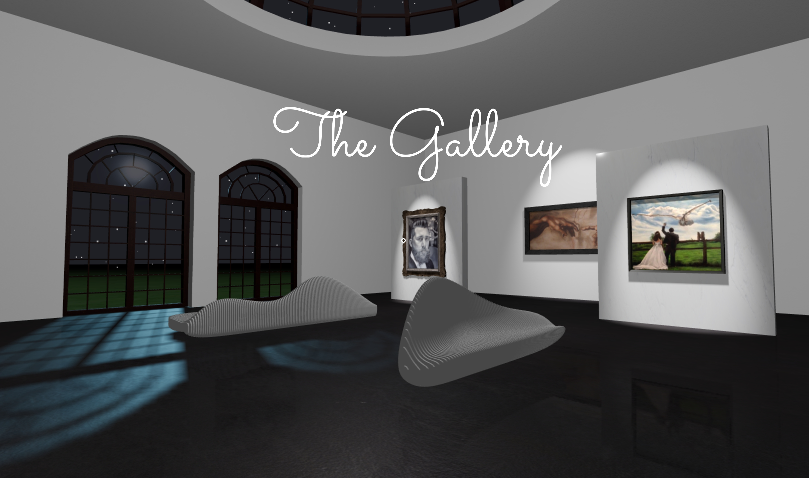

# The Gallery



### View the app online 

Open the live app in your browser with this link: https://deanssmart.github.io/the-gallery/

## Intro

Interactive 3D art gallery to showcase some of my drawings and paintings  

### Technologies

- JavaScript
- Three.js
- React
- react-three-fiber
- JSX
- HTML/CSS
- Git (version managed)
- Blender

### Functionality and Features

- First-person view and controls 
- WASD movement 
- MOUSE to look
- SHIFT to run
- SPACE to fly
- N to toggle between night and day
- P to toggle performance
- More features will be added... so watch this space

### How to Use

- Click the center dot to allow the browser control of your pointer
- Use W to move forward, A to move left, D to move right and S to move backwards
- Use the mouse to look in the direction you want to move
- (If you've played any first-person shooters youll be familliar)
- Hold SHIFT to run (there is no security guard in this gallery)
- Hold SPACE to fly (because why not!)
- Press N at any time to toggle the environment between night and day
- If you have a slower laptop and the frame rate is a bit low press P, this will turn off all the spotlights on the paintings so should allow the app to runs smoother although it won't look as visually intended 
- (I intend to bake the lighting at some point in the future)

## Setup on your machine

1. Create a local directory on your machine 
2. Run the following code in your command line to navigate into that directory:   

```shell 
$ cd ~/your-directory-name-here
```
3. Copy the SSH key from this GitHub repository `git@github.com:deanssmart/the-gallery.git`

4. Run the following code in your command line to clone the repo to your machine (you can change the app-name to what you desire):  

```shell 
git clone git@github.com:deanssmart/the-gallery.git <app-name>
```
5. Navigate to your new app directory (the app name you just picked):

```shell 
$ cd app-name
```
6. Install the dependencies:

```shell 
npm i
```
7. Run the following command to launch the app in your default browser at http://localhost:3000/:

```shell 
npm start
```
8. Enjoy

## Credits

### 3D Models (Sketchfab)

- Adapted fancy picture frame from Jamie McFarlane https://skfb.ly/6QZpO 
- Adapted square picture frame from Lonit https://skfb.ly/6WMFM
- Adapted long picture frame from ROOFUSMAN1976 https://skfb.ly/6SKu9
- Adapted Victorian window from expy https://skfb.ly/6qupO
- Adapted industrial set from feivelyn https://skfb.ly/6SqIT
- Parametric benches from decah https://skfb.ly/6qwEw & https://skfb.ly/6qvZD

### Textures
- Grass texture from Simon Murray https://www.brusheezy.com/textures/20185-seamless-green-grass-textures
- Marble textures from ShareTextures https://opengameart.org/users/sharetextures
- Wall texture from Seme Design Lab http://www.texturise.club/2016/12/seamless-white-wall-paint-stucco.html
- Moon texture from Richard Andersson https://richardandersson.net/?p=331
